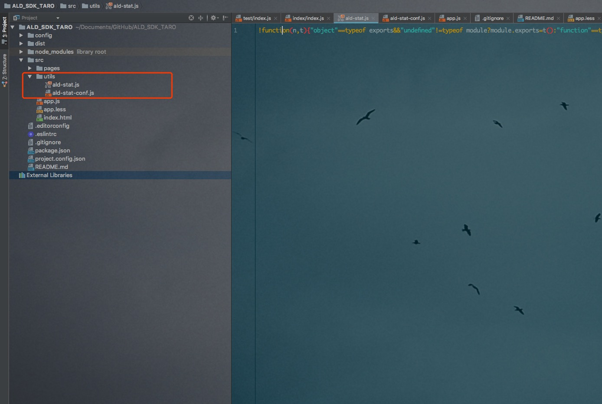
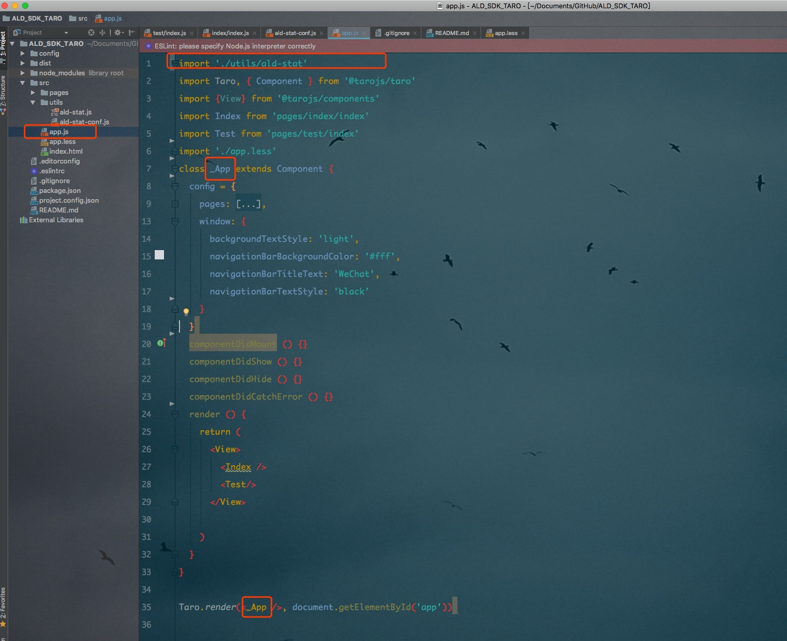
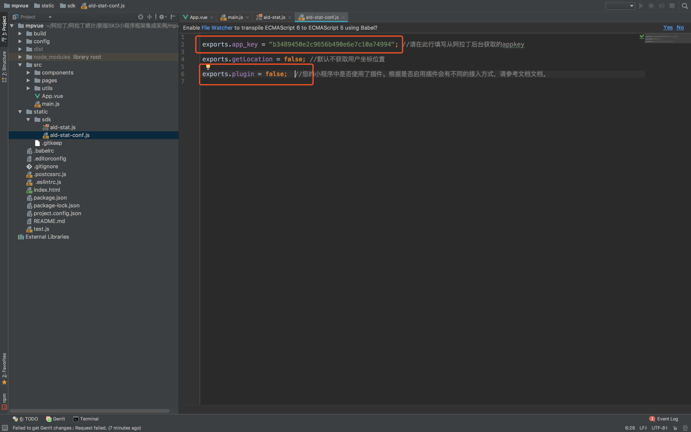
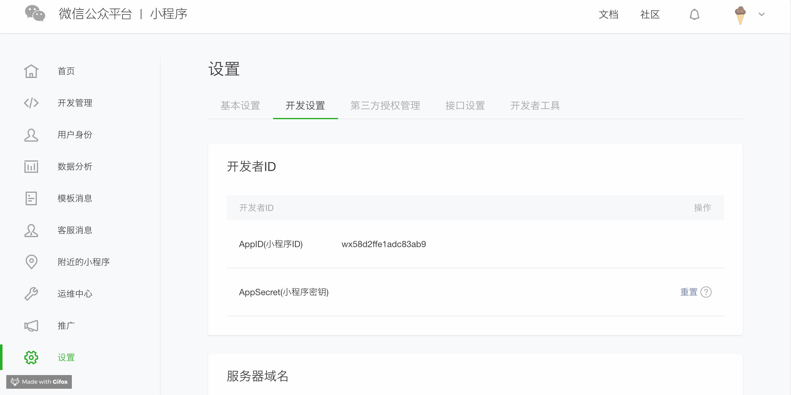
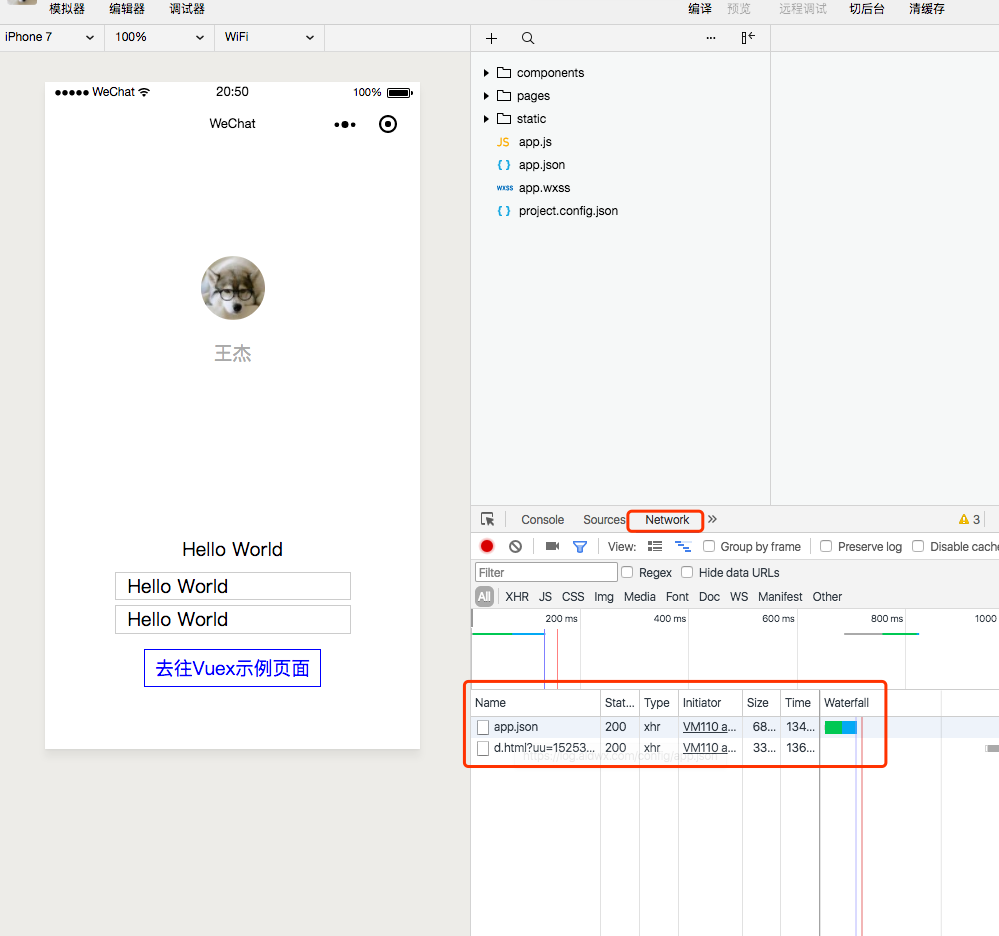
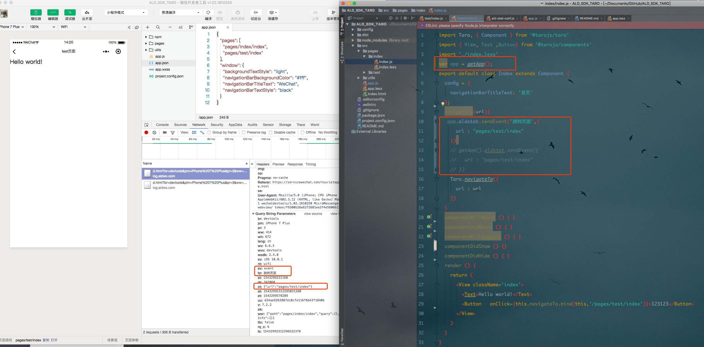

# 如何将SDK集成至Taro框架构建的小程序中

---

## 1.1 将SDK集成至Taro框架构建的小程序中

 > 下载 [SDK](http://tongji.aldwx.com/tool/ald-stat.zip)，将解压得到的文件夹 **sdk** 拷贝到小程序项目的 **utils** 目录中。



## 1.2 在项目中Taro的入口文件app.js引入SDK

> 请注意`class类的命名` 不能是`App`,且注意`render`的时候要与类名称一致

```javascript
  import './utils/ald-stat'
      //......
      // 类名称不能是App
  class _App extends Component{
      //......
  }
  Taro.render(<_App />, document.getElementById('app'))

```



## 1.3 配置SDK

> 使用编辑器打开 `ald-stat-conf.js` 文件，填写在阿拉丁申请的 app\_key并配置`plugin`为`false`

```js
  //ald-stat-conf.js
  exports.app_key = ""; //请在引号中填写从阿拉丁后台获取的appkey
  exports.getLocation = false; //默认不获取用户坐标位置
  exports.plugin = false;  //您的小程序中是否使用了插件。根据是否启用插件会有不同的接入方式，请参考文档文档。
```


## 1.4 添加微信request合法域名



管理员或开发者身份在[微信小程序后台](mp.weixin.com)→设置→开发者设置中添加 request合法域名**log.aldwx.com**

## 1.5 检查是否集成成功

> 在小程序开发编辑器中，查看控制台中的Network是否有信息上报，且status状态为200。



# 二. 高级功能


## 2.1 事件功能

> 仅需统计事件,不统计参数时,可使用如下方法：

```js
var app = getApp();
app.aldstat.sendEvent('事件名称'); // 事件名称规范: 不超过255个字符
```

> 需要统计带参数的事件时,可使用如下方法：

```js
var app = getApp();
app.aldstat.sendEvent('事件名称',{
	'参数' : '参数值',
	'参数_2' : '参数值2'
});

```

> 如何在Page中进行埋点


```js
import Taro, { Component } from '@tarojs/taro'
import { View, Text ,Button} from '@tarojs/components'
import './index.less'
var app = getApp();
export default class Index extends Component {
  config = {
    navigationBarTitleText: '首页'
  };

  navigateTo(url){
   app.aldstat.sendEvent('跳转页面',{
      url : "pages/test/index"
    })
    // getApp().aldstat.sendEvent({
    //   url : "pages/test/index"
    // })
    Taro.navigateTo({
      url : url
    })
  }
  componentWillMount () { }

  componentDidMount () { }

  componentWillUnmount () { }
  componentDidShow () {}
  componentDidHide () { }
  render () {
    return (
      <View className='index'>
        <Text>Hello world!</Text>
        <Button   onClick={this.navigateTo.bind(this,'/pages/test/index')}>123123</Button>
      </View>
    )
  }
}


```


> 检查自定义埋点是否上报成功,在开发者工具中




| 参数 | 类型 | 描述 |
| :--- | :--- | :--- |
| 事件名称 | string | 描述用户的动作名称，不超过255个字符，支持特殊字符 |
| 参数 | string | 动作的参数，不超过255个字符，支持特殊字符但不包括（英文逗号 , 英文冒号 : 点 .）  |
| 参数值 | string | 动作的参数值，不超过255个字符，支持特殊字符但不包括（英文逗号 , 英文冒号 : 点 .）  |


## 2.2 设置是否获取用户坐标（可选）

> 阿拉丁统计 SDK 默认不会在小程序启动时获取用户的坐标信息。<br>
> 请注意： <br>
> a.不获取用户坐标信息会影响用户地域分布的分析准确性；<br>
> 可以通过修改配置文件启用这两项功能：使用编辑器打开`ald-stat-conf.js` 文件，修改 getLocation（位置信息）配置项为 true 即可开启应功能（缺省为 false，即关闭）。


